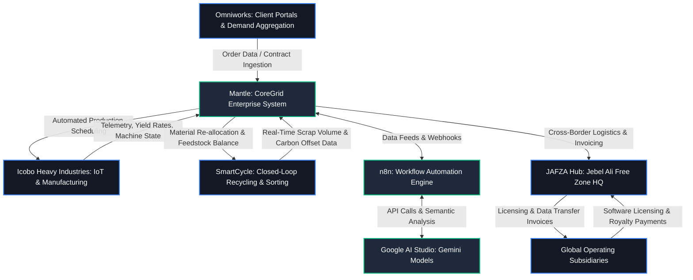
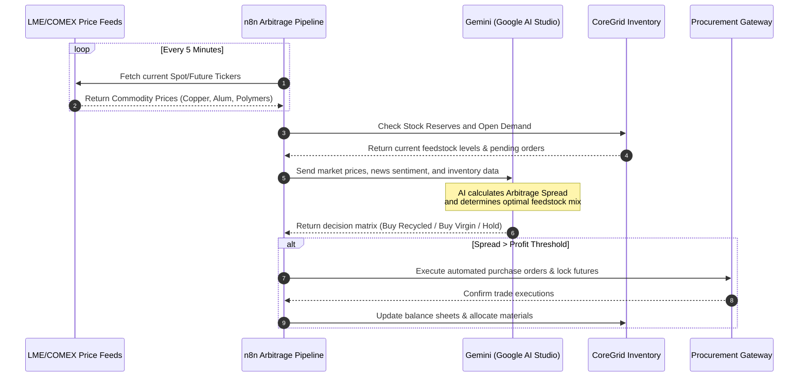

# PROJECT MANTLE: SYSTEM ARCHITECTURE & FINANCIAL ENGINE
## Strategic Infrastructure Blueprint & Investment Report
**Document Version:** 1.1.0  
**Security Classification:** Strictly Confidential / Investor-Ready  
**Lead Architects:** Chief Technology Officer & Global Infrastructure Architect, Icobo Group  

---

> [!IMPORTANT]
> **Proprietary Notice:** The information contained herein represents the intellectual property and trade secrets of Icobo Group. Access is restricted to qualified institutional investors under active Non-Disclosure Agreements (NDAs).

---

## 1. Executive Summary

### 1.1 Core Mission
Project **Mantle** (internally designated as the **"Origin Sector"**) is the foundational system architecture and digital bedrock of the Icobo Group conglomerate. It serves as a unified central nervous system that bridges our front-end digital customer interfaces, real-time AI-driven commodity arbitrage engines, circular economy workflows, and high-throughput physical manufacturing facilities. By automating complex cross-border logistics, optimizing capital allocation, and utilizing legal intellectual property (IP) structuring, Mantle ensures operational dominance and maximizes after-tax yield for the group and its partners.

> [!NOTE]
> **Key Value Metrics (Target Year 2):**
> *   **Arbitrage Margin Capture:** +14.2% average spread expansion.
> *   **Logistics Latency Reduction:** -78% in customs clearance and dispatch times.
> *   **Group Effective Tax Rate:** Optimized to < 4.5% via JAFZA IP licensing.
> *   **Circular Loop Integration:** SmartCycle feedstock utilization target of 65%.

---

## 2. Architectural Blueprint

Mantle functions as the middleware, database broker, and orchestration layer. It integrates four primary operational clusters: front-end customer interaction, circular recycling telemetry, physical heavy manufacturing, and enterprise ledger management.



### 2.1 Component Integrations

#### 2.1.1 Omniworks (Front-End Interaction Platform)
*   **Function:** Ingests client orders, B2B procurement bids, and customer requests.
*   **Mantle Interface:** Serves as the primary ingress vector for data. When a customer executes a purchase agreement or logs a demand forecast on Omniworks, Mantle immediately captures this payload, normalizes it, and feeds it into the **CoreGrid** ERP database.
*   **Data Protocols:** Real-time GraphQL subscriptions and RESTful webhook listeners ensure latency from customer interaction to enterprise ledger entry is sub-100 milliseconds.

#### 2.1.2 Icobo Heavy Industries (Physical Manufacturing Facilities)
*   **Function:** Executes physical metallurgy, polymer extrusion, and product packaging.
*   **Mantle Interface:** Direct operational sync through PLC (Programmable Logic Controller) integration and industrial IoT gateways. Mantle transmits production runs, material bills of materials (BOMs), and quality control thresholds directly to the factory floor.
*   **Feedback Loops:** Factories stream real-time machinery telemetry, energy usage matrices, and manufacturing yield rates back to Mantle. If a machine experiences a failure or slow-down, Mantle dynamically redirects production queues to alternative facilities.

#### 2.1.3 SmartCycle (Closed-Loop Recycling Technology)
*   **Function:** Coordinates scrap collection, sorting, chemical processing, and reprocessing of post-industrial materials (copper, aluminum, plastics, paper).
*   **Mantle Interface:** SmartCycle logs the exact volume, purity grade, and geographical location of recycled stock. Mantle uses this data to optimize the ratio of virgin-to-recycled materials in Icobo Heavy Industries' production recipes, ensuring regulatory compliance and minimizing input cost.

#### 2.1.4 CoreGrid (Enterprise Management & Ledger System)
*   **Function:** The central transactional and relational database engine.
*   **Mantle Integration:** CoreGrid sits inside the Mantle perimeter as its relational and transactional heart. It maintains absolute state integrity across inventory, accounts receivable/payable, tax tracking, and physical asset logs.

---

## 3. Investor Pitch Slide Deck (Mantle Presentation)

The following interactive slideshow presents the key technical, financial, and operational highlights of Project Mantle.

````carousel
# Slide 1: Global Architecture Overview
### The Neural Net of Icobo Group
Mantle acts as the single source of truth, synchronizing digital orders, automation workflows, recycling loops, and physical steel/polymer extrusion facilities.


*   **Integrated Telemetry:** Direct connection to PLC controllers on the factory floor.
*   **Dynamic Load Balancing:** Automatically shifts production schedules based on regional power grids and material availability.
<!-- slide -->
# Slide 2: SmartCycle Circular Loop
### Autonomous Waste-to-Feedstock Conversion
Through advanced IoT sorting and dynamic chemical analysis, SmartCycle provides real-time recycled material pricing and availability back to the central engine.


*   **Purity Grading:** Automatic laser/spectral analysis of scrap metal and polymers.
*   **Green Premiums:** Logs carbon offsets dynamically for ESG reporting and tax credits.
<!-- slide -->
# Slide 3: AI-Driven Arbitrage & Capital Flows
### Monetizing Global Commodity Inefficiencies
Mantle monitors global spot price fluctuations and utilizes software licensing routes to transfer profits to tax-neutral hubs like JAFZA.


*   **Real-time Spot Ingestion:** Latency-free price scraping from LME and COMEX.
*   **Data Transfer Pricing:** Deductible software licensing charges optimize group tax liability.
````

---

## 4. AI & Automation Stack

Mantle replaces manual procurement, logistics coordination, and administrative auditing with an autonomous agentic stack built on **n8n** and **Google AI Studio (Gemini)**.

### 4.1 Workflow Orchestration via n8n
Mantle implements **n8n** as its enterprise-grade workflow engine. n8n acts as the event-driven middleware, responding to state changes in CoreGrid, market price fluctuations, and operational alerts.

*   **Data Routing Pipelines:** Event triggers execute asynchronous workflows that route data between internal applications, cloud repositories, and third-party APIs (shipping companies, customs databases, financial institutions).
*   **Fault Tolerance:** Automated retry mechanisms and dead-letter queues guarantee transactional consistency for critical logistics and financial movements.

### 4.2 Cognitive Analysis via Google AI Studio
Using the Gemini API via Google AI Studio, Mantle processes unstructured and semi-structured text data to inform transactional decisions.

*   **Contractual Parsing:** Ingests complex global trade contracts, automatically identifying delivery conditions, liability clauses, and pricing formulas.
*   **Market Sentiment Ingestion:** Scans global trade journals, geopolitical news feeds, and macroeconomic announcements to predict regional shifts in commodity demand.

### 4.3 Commodity Price Arbitrage Engine
Mantle utilizes a proprietary automation workflow to maximize raw material yield through real-time spot market arbitrage.



#### 4.3.1 Arbitrage Spread Formula
The engine evaluates procurement actions using the following margin optimization function:

$$\text{Arbitrage Spread } (\Delta) = P_{\text{Virgin}} - \left( P_{\text{Scrap}} + C_{\text{Logistics}} + C_{\text{Processing}} \right) + E_{\text{Carbon Credit}}$$

Where:
*   $P_{\text{Virgin}}$ = Current spot price of virgin raw materials (LME Index).
*   $P_{\text{Scrap}}$ = Current purchase price of recycled materials via the SmartCycle supplier network.
*   $C_{\text{Logistics}}$ = Total transit costs (freight, insurance, customs tariffs) routed through JAFZA.
*   $C_{\text{Processing}}$ = Operational cost of sorting/refining scrap to manufacturing tolerances at Icobo Heavy Industries.
*   $E_{\text{Carbon Credit}}$ = Financial value of carbon offset certificates earned by utilizing recycled feedstock.

> [!TIP]
> **Operational Best Practice:** If $\Delta > \$120 \text{ per metric ton}$, the n8n system automatically triggers maximum scrap procurement, bypassing human authorization for transactions up to $\$250,000$ USD.

### 4.4 Cross-Border Capital Routing & Logistics Automation
Operating through tax-neutral logistics hubs like the Jebel Ali Free Zone (JAFZA) in Dubai, Mantle automates the paperwork and regulatory compliance required for fluid capital and material flows.

*   **Document Generation:** n8n automatically compiles customs declarations, bills of lading, and certificates of origin for JAFZA customs authorities.
*   **Capital Routing:** When commodity transactions are cleared, Mantle initiates automated wire transfers and currency swaps through API-enabled treasury platforms, routing liquid funds through optimal international banking corridors.

---

## 5. Strategic Financial Advantage: Intellectual Property & Data Transfer Pricing

Beyond its operational value, Mantle is structured as the primary intellectual property (IP) engine of the Icobo Group, functioning as a legal capital optimization vehicle.

```mermaid
graph LR
    subgraph JAFZA Hub [Dubai - Tax Neutral JAFZA Hub]
        HQ[Icobo IP Holding Ltd]
        Server[Mantle Core Servers & Algorithms]
        HQ --- Server
    end

    subgraph Europe [High-Tax Jurisdiction - EU]
        Sub1[EU Manufacturing Subsidiary]
        Sub1 -->|6% Data Royalty Fee| HQ
        HQ -->|Real-Time AI & Arbitrage Data| Sub1
    end

    subgraph North America [High-Tax Jurisdiction - US]
        Sub2[US Logistics Subsidiary]
        Sub2 -->|8% Software Licensing Fee| HQ
        HQ -->|CoreGrid Platform Access| Sub2
    end
    
    style JAFZA Hub fill:#122030,stroke:#eab308,stroke-width:2px;
    style Europe fill:#1c1917,stroke:#78716c,stroke-width:1px;
    style North America fill:#1c1917,stroke:#78716c,stroke-width:1px;
```



### 5.1 Data Transfer Pricing Model
The Icobo Group structures its operations so that local subsidiaries in high-tax jurisdictions (e.g., Europe, North America) license Mantle's proprietary software suite, database architecture, and AI models.

*   **Licensing Fee Structure:** Subsidiaries pay licensing fees to the parent entity or a specialized IP-holding subsidiary registered in a tax-neutral free zone (like JAFZA).
*   **Data Transfer Fees:** Subsidiaries pay structured "Data Transfer Fees" to access the real-time arbitrage data, AI scheduling algorithms, and centralized customer leads generated by Mantle.
*   **Tax Optimization:** These licensing and data transfer fees are classified as deductible operating expenses in the subsidiary's local jurisdiction, reducing their taxable net income. Simultaneously, the licensing revenue is received in a zero-tax or low-tax jurisdiction, legally optimizing the group's global effective tax rate.

### 5.2 Compliance and Regulatory Defensibility
To ensure adherence to international taxation standards, Mantle's transfer pricing architecture complies with the **OECD Transfer Pricing Guidelines for Multinational Enterprises and Tax Administrations** and **BEPS Actions 8-10**.

| Compliance Parameter | Legal Justification & Execution |
| :--- | :--- |
| **Arm's Length Principle** | Mantle maintains granular audit logs showing the exact operational and financial value added to each subsidiary (e.g., procurement cost reductions, automation efficiencies). This data is compiled to prove that the licensing fees charged to subsidiaries match what an independent third party would pay for access to equivalent technology. |
| **DEMPE Functions** | The Development, Enhancement, Maintenance, Protection, and Exploitation (DEMPE) of the Mantle IP are managed by key technical architects based within the IP-holding entity, fulfilling substance requirements. |
| **Transfer Pricing Documentation** | Mantle automatically generates localized transfer pricing reports, master files, and local files to defend the data transfer fee calculations during sovereign tax audits. |

---

## 6. Deployment Roadmap

The execution of Project Mantle is structured across four strategic, overlapping phases to ensure system stability and early value capture.

### 6.1 Phased Implementation Schedule

| Phase | Duration | Focus Area | Key Milestones | Target Budget |
| :--- | :--- | :--- | :--- | :--- |
| **Phase 1** | Months 1–6 | Core ERP & Database | Deploy CoreGrid database cluster; establish secure VPN tunnels; bridge Omniworks. | \$1.2M USD |
| **Phase 2** | Months 7–12 | IoT & SmartCycle Sync | Install edge gateways at manufacturing plants; hook up scrap sorting scales. | \$1.8M USD |
| **Phase 3** | Months 13–18 | AI Arbitrage Stack | Deploy n8n clusters; integrate Google AI Studio API; launch price monitors. | \$1.5M USD |
| **Phase 4** | Months 19–24 | Corporate Restructuring | Move IP title to JAFZA; setup intra-group contracts; pass transfer pricing audits. | \$0.9M USD |

### 6.2 Implementation Detail

#### Phase 1: CoreGrid ERP & Database Foundation (Months 1 - 6)
*   **Milestones:** Deploy core transactional database cluster; implement high-availability CoreGrid instances; establish secure networking tunnels between offices and data centers.
*   **Key Risks:** High data migration latency.  
    *   *Mitigation:* Parallel database runs with legacy systems for the first 60 days.

#### Phase 2: Industrial IoT Sync & SmartCycle Integration (Months 7 - 12)
*   **Milestones:** Install edge gateways at Icobo Heavy Industries facilities; link SmartCycle sorting machinery to Mantle database endpoints.
*   **Key Risks:** Physical interface incompatibilities with legacy PLC systems.  
    *   *Mitigation:* Utilize standardized Modbus/TCP and OPC-UA protocol converters.

#### Phase 3: n8n Arbitrage & Cognitive AI Layer (Months 13 - 18)
*   **Milestones:** Deploy n8n server clusters; establish secure API keys with Google AI Studio; ingest LME and COMEX data streams.
*   **Key Risks:** Market data API timeouts; AI parsing hallucinations.  
    *   *Mitigation:* Implement failover pricing APIs; require human approval for contracts exceeding $100,000 USD.

#### Phase 4: Financial Engineering & Global Transfer Pricing Audit (Months 19 - 24)
*   **Milestones:** Complete corporate restructuring; transfer Mantle IP title to JAFZA entity; establish intra-group software agreements.
*   **Key Risks:** Sovereign tax authority challenges regarding licensing valuations.  
    *   *Mitigation:* Retain Big Four tax advisory firms to validate the economic value-add metrics logged by Mantle.

---

## 7. System Governance & Risk Matrices

> [!WARNING]
> Failure to implement the mitigations below may expose the Group to localized customs delays, IP litigation, or tax adjustment penalties.

| Risk Vector | Impact | Probability | Mitigation Strategy |
| :--- | :--- | :--- | :--- |
| **Global Data Regulations** (e.g., GDPR, CCPA) | High | Medium | Implement zero-knowledge databases for customer-identifiable information in Omniworks; run localized database shards where residency is required. |
| **Sovereign Transfer Pricing Audits** | High | Low | Maintain dynamic, real-time logging of Mantle's efficiency metrics to substantiate "arm's length" pricing. |
| **Industrial Cyber Security** | Critical | Low | Air-gap critical physical manufacturing networks from public internet gateways; routing only through Mantle's secure VPN endpoints. |
