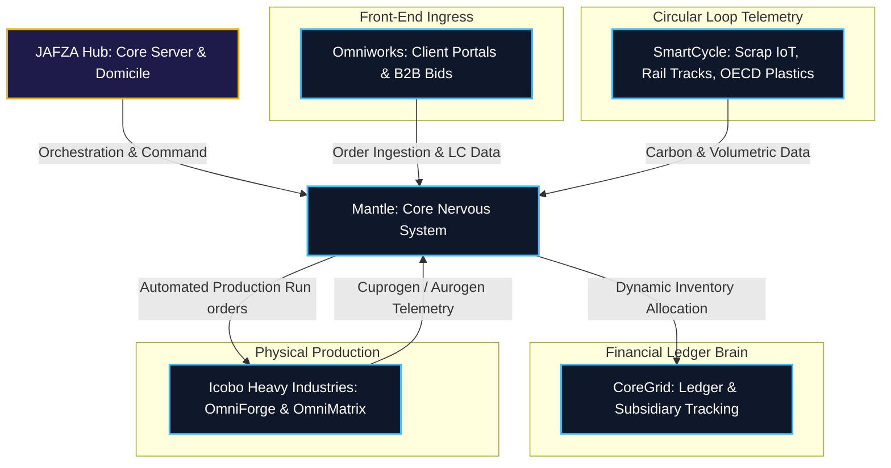
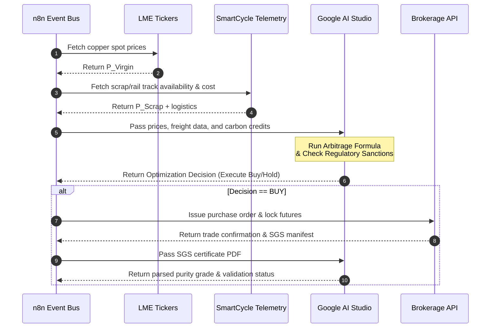
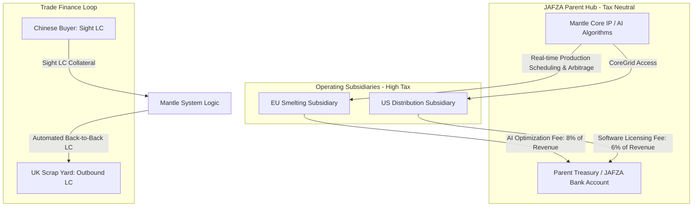

# PROJECT MANTLE: SYSTEM ARCHITECTURE & FINANCIAL ENGINE
## Strategic Infrastructure Blueprint & Investment Report
**Document Version:** 2.0.0  
**Security Classification:** Strictly Confidential / Investor-Ready  
**Lead Architects:** Chief Technology Officer & Global Infrastructure Architect, Icobo Group  

---

> [!IMPORTANT]
> **Proprietary Notice:** The information contained herein represents the proprietary system architecture, financial engineering pipelines, and trade secrets of the Icobo Group. Access is restricted strictly to qualified institutional investors under active Non-Disclosure Agreements (NDAs).

---

## 1. Executive Summary & Strategic Purpose

### 1.1 Core Identity
Project **Mantle** (designated as the **"Origin Sector"**) is the proprietary digital nervous system and centralized architecture of the Icobo Group. It is a strictly controlled, closed-loop enterprise environment designed to operate as a single source of truth (SSOT) and automated execution engine for the group's global industrial and financial activities.

```
                      +---------------------------------------+
                      |         JAFZA holding hub (UAE)       |
                      |   (Mantle Core Server & IP Domicile)  |
                      +-------------------+-------------------+
                                          |
                     +--------------------+--------------------+
                     |                                         |
        +------------v------------+               +------------v------------+
        |        OMNIWORKS        |               |       SMARTCYCLE        |
        | (B2B Orders / Front-End)|               |  (Recycling loop IoT)   |
        +------------+------------+               +------------+------------+
                     |                                         |
                     +--------------------+--------------------+
                                          |
                     +--------------------+--------------------+
                     |                                         |
        +------------v------------+               +------------v------------+
        |        COREGRID         |               | ICOBO HEAVY INDUSTRIES  |
        | (Subsidiary Ledger/ERP) |               | (OmniForge/OmniMatrix)  |
        +-------------------------+               +-------------------------+
```

### 1.2 Mission Statement & Purpose
Mantle was engineered to achieve three primary strategic objectives:
1.  **Zero-Latency Trading:** Eliminate human delay and administrative friction in global raw commodity trading.
2.  **Autonomous Compliance & Finance:** Automate cross-border financial compliance, capital routing, and trade finance leverage without tying up corporate liquidity.
3.  **Digital-to-Physical Sync:** Synchronize digital transaction queues directly with the mechanical operations of our heavy manufacturing plants.

### 1.3 Jurisdiction & Domicile
To maximize asset protection and tax efficiency, the core intellectual property (IP) titles, software algorithms, database schemas, and primary server clusters of Mantle are legally domiciled within our tax-neutral holding entity located in the **Jebel Ali Free Zone (JAFZA), Dubai, UAE**. 

---

## 2. The 4-Pillar Integration Ecosystem

Mantle sits at the center of the Icobo Group conglomerate, orchestrating data and control signals between four primary operational pillars.



### 2.1 The Pillars Detailed

#### 2.1.1 Omniworks (The Interaction Front-End)
Omniworks is the B2B portal through which clients place orders, submit bids, and establish long-term procurement forecasts. It ingests:
*   Global purchasing commitments.
*   B2B supply tenders.
*   Trade collateral documentation (Sight LCs).
Mantle parses this incoming data instantly, running verification scripts before committing it to the ledger.

#### 2.1.2 SmartCycle (The Tech Loop Telemetry)
SmartCycle handles the telemetry of our circular material loop. It monitors the global availability, geographic location, and logistics status of scrap materials, including:
*   Heavy Melting Scrap (HMS 1 & 2).
*   Used rail tracks (R50/R65 specifications).
*   OECD-grade recyclable polymers and plastics.
SmartCycle logs volumetric data and carbon-offset metrics (used to calculate green premiums) directly into Mantle's relational database.

#### 2.1.3 CoreGrid (The Ledger Brain)
CoreGrid is the transactional heart of Mantle's enterprise planning layer. It maintains the absolute state of:
*   The unified group financial ledger.
*   The parent holding company structure.
*   Real-time balance sheet states for each regional subsidiary.

#### 2.1.4 Icobo Heavy Industries (The Physical Execution)
This is the physical production infrastructure, featuring our advanced **OmniForge** (metallurgical smelting and casting) and **OmniMatrix** (extrusion and refining) systems.
*   Mantle routes digital orders directly to these facilities, bypassing intermediate plant management.
*   Raw scrap is converted into our high-margin, proprietary product lines: **Cuprogen** (ultra-pure copper rod and wire) and **Aurogen** (high-grade aluminum extrusions), alongside industrial plastic granules and paper packaging.

---

## 3. Investor Pitch Slide Deck (Mantle Presentation)

The following presentation details the operational mechanics, cash routing, and industrial execution of Project Mantle.

````carousel
# Slide 1: System-Wide Architecture
### Closed-Loop Enterprise Environment
Mantle acts as the centralized digital nervous system of the Icobo Group, synchronizing B2B sales portals, recycling loops, financial ledgers, and automated smelting furnaces.


*   **Zero-Human Latency:** High-availability API mesh links orders directly to machine code.
*   **Safe-Doubt Execution:** Failover servers locally deployed in JAFZA, UAE.
<!-- slide -->
# Slide 2: SmartCycle & Physical Execution
### Smelting Raw Scrap to Premium Brands
Our IoT-enabled sorting facilities feed raw HMS and used R50/R65 rail tracks into OmniForge and OmniMatrix setups to produce Cuprogen and Aurogen.


*   **Feedstock Tracking:** SmartCycle monitors purity levels and logistics in real-time.
*   **Output Quality Control:** Laser telemetry tracks Cuprogen extrusion tolerances.
<!-- slide -->
# Slide 3: Financial Engineering & IP Routing
### Capital Optimization and Tax Neutrality
Mantle uses proprietary AI algorithms to route subsidiary earnings to JAFZA via software licensing fees and automates Back-to-Back Letters of Credit.


*   **Deduction Optimization:** Software licenses reduce high-tax local liabilities.
*   **Zero Cash-Lock:** Automates Back-to-Back LC routing to purchase UK scrap.
<!-- slide -->
# Slide 4: ESG & CBAM Compliance
### Capitalizing on Carbon Offset Tracking
By tracking the exact emissions saved by utilizing recycled feedstock, Mantle enables our metals to be certified as "green-processed."

*   **Bypassing CBAM:** Avoids EU Carbon Border Adjustment Mechanism import taxes.
*   **Green Premium Capture:** Commands up to a 15% margin markup on Cuprogen and Aurogen.
````

---

## 4. AI & Automation Tech Stack

Mantle’s execution layer relies on an automated, multi-agent framework designed to operate 24/7 without human oversight.

### 4.1 Workflow Orchestration via n8n
Mantle deploys **n8n** as its primary visual workflow engine to connect and synchronize fragmented global APIs:
*   **Maritime Shipping Lanes:** Monitors container locations and ports via AIS tracking APIs.
*   **Commodity Exchanges:** Ingests live prices from LME and COMEX.
*   **Banking Infrastructure:** Connects directly to SWIFT API portals to track wire clearings and Letter of Credit activations.
n8n acts as the central event bus, triggering automated pipelines upon detecting state changes in any linked system.

### 4.2 Cognitive Automation via Google AI Studio
Using the Gemini models via Google AI Studio, Mantle executes complex cognitive steps:
*   **Document Parsing:** Parses unstructured supplier payloads, such as **SGS inspection certificates**, bills of lading, and custom declarations.
*   **Regulatory Analysis:** Dynamically scans global trade laws and import tariffs, ensuring shipping lanes do not conflict with active trade sanctions or tax regulations.
*   **Arbitrage Calculation:** Computes spreads and routes purchasing instructions to procurement APIs.



### 4.3 Flutter Executive Layer
Mantle exposes a real-time data visualizer via custom-built **Flutter** web and mobile applications.
*   Provides the executive board with a global, unified dashboard showing raw material queues, inventory, current capital flows, and arbitrage profits.
*   Supports secure, biometrically authenticated override capabilities for trades exceeding default threshold limits.

---

## 5. Financial Engineering & Capital Retention Architecture

Mantle is engineered to serve as a legal financial weapon, optimizing the group's global cash flow and tax structures.



### 5.1 Data Transfer Pricing (The Profit Router)
Because Mantle's proprietary AI algorithms (owned by the JAFZA holding company) dictate the operational schedule and material buying/selling decisions of regional subsidiaries, these subsidiaries are charged an **AI Optimization & Software Licensing Fee**.
*   **Mechanism:** High-tax operating subsidiaries (e.g., in the EU or US) deduct these fees as necessary operating expenses.
*   **Result:** Operating profits are legally shifted away from high-tax jurisdictions and consolidated inside the tax-neutral JAFZA parent treasury, minimizing the group's global corporate tax liability.

### 5.2 Automated Trade Finance (B2B Letters of Credit)
Mantle bypasses traditional bank delays and credit constraints by automating **Back-to-Back Letters of Credit (LC)**:
1.  **Ingress:** Omniworks secures a buyer (e.g., in India or China) who issues an **Irrevocable Sight Letter of Credit** as collateral for a shipment of Cuprogen.
2.  **Collateral Routing:** Mantle instantly registers the Sight LC in CoreGrid.
3.  **Outbound Issuance:** Using the Sight LC as collateral, Mantle's banking integration API automatically issues a corresponding outbound Letter of Credit to our scrap suppliers (e.g., in the UK) to release raw used rail tracks (R50/R65) or HMS.
4.  **Capital Efficiency:** The entire procurement loop is financed using the buyer's collateral, requiring **zero cash lock-up** from Icobo Group's internal cash reserves.

### 5.3 ESG & Green Premium Arbitrage (CBAM Mitigation)
Mantle tracks the carbon-intensity metrics of every metric ton of metal moving through the SmartCycle loop.
*   **Certification:** Generates auditable data certifying that our **Cuprogen** and **Aurogen** products are manufactured using green recycled feedstock and low-emission smelting loops.
*   **CBAM Tax Bypass:** This certification serves as the legal documentation required to bypass the European Union's **Carbon Border Adjustment Mechanism (CBAM)** import taxes.
*   **Premium Pricing:** Enables the Icobo Group to sell these materials at a premium ("Green Premium"), commanding a **12% to 15% markup** over standard LME indexes, while qualifying for international ESG subsidies.

---

## 6. System Governance & Risk Matrices

> [!WARNING]
> Regulatory compliance regarding transfer pricing and international trade finance requires strict enforcement of the mitigation strategies defined below.

| Risk Vector | Impact | Probability | Mitigation Strategy |
| :--- | :--- | :--- | :--- |
| **Transfer Pricing Audits** | High | Medium | Enforce BEPS Actions 8-10 compliance by logging active DEMPE functions. Document that JAFZA personnel manage the core development and maintenance of Mantle. |
| **CBAM Compliance Audits** | High | Low | Implement blockchain-anchored telemetry audits for all SmartCycle energy logs, preventing retroactive editing of carbon metrics. |
| **Trade Finance Defaults** | Critical | Low | Restrict Back-to-Back LC automation to pre-approved, top-tier international issuing banks (e.g., HSBC, Standard Chartered). |
| **Industrial Cyber Security** | Critical | Low | Air-gap all PLC networks at Icobo Heavy Industries; routing automated instructions exclusively through Mantle's encrypted VPN tunnels. |

---

## 7. Deployment Roadmap & Milestones

The roadmap outlines the implementation schedule for the systems integration.

### 7.1 Phased Execution Schedule

```
Phase 1: Core Ledger & JAFZA Server setup
[====================]
Phase 2: IoT Sync & Smelting Telemetry
         [====================]
Phase 3: n8n Arbitrage & Trade Finance Loop
                  [====================]
Phase 4: Regulatory Auditing & Transfer Pricing
                           [====================]
Month:   0    3    6    9    12   15   18   21   24
```

*   **Phase 1: Database & CoreGrid Setup (Months 1–6):** Focuses on database configuration, securing JAFZA hosting, and integrating with Omniworks.
*   **Phase 2: Heavy Industries IoT Integration (Months 7–12):** Focuses on PLC links at manufacturing sites and connecting SmartCycle volumetric sensors.
*   **Phase 3: n8n Pipelines & Trade Finance (Months 13–18):** Focuses on deploying n8n nodes, integrating Gemini for document parsing, and connecting the automated SWIFT LC API.
*   **Phase 4: Audit & Regulatory Compliance (Months 19–24):** Focuses on transfer pricing audits and establishing the ESG carbon certification system.
